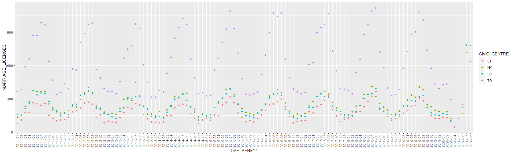

Authored by Xinyi Zhang

```{r setup, include=FALSE}
knitr::opts_chunk$set(collapse = TRUE)

```

# Abstract
From a cultural, social, and even legal viewpoint, getting married is widely considered one of the most significant events in a person's life. In this web post, we identify the seasonal and annual trends in the number of marriage licenses that are issued by the Toronto City Clerk's Office as published in the "Marriage Licence Statistics" dataset on Toronto's Open Data Portal. Most notably, thanks to public health policies and public adherence to those policies, the number of marriage licenses issued in the past few months are noticeably lower than usual. Our findings from exploring this dataset have provided a basic method of evaluating the effectiveness of social distancing policies and big picture-wise have pinpointed the cyclical trends of the number of marriage licenses being issued for curious couples and interested sociologists.


# Introduction
First paragraph: General. Motivational. Majors specific finding. 

Second paragraph: More about what you did and found.

Third paragraph: Outline of the paper. Future work. Weaknesses.


# Data Description 
The "Marriage Licence Statistics" dataset contains 453 observations that document the number of marriage licenses issued per civic center per month in the city of Toronto. The dataset has only 4 features: 

* _id: an unique observation identifier
* CIVIC_CENTRE: a two letter code for one of four civic centers in Toronto ("TO" being Toronto City Hall, "NY" being North York Civic Center, "ET" being Etobicoke Civic Center, and "SC" being Scarborough Civic Center)
* MARRIAGE_LICENSES: a count of how many marriage licenses were issued in the given time period
* TIME_PERIOD: the year and month the observation was made


# Data Analysis and Discussion
You can embed an R code chunk like this:

```{r cars}
summary(cars)
fit <- lm(dist ~ speed, data = cars)
fit
```

# Including Plots

You can also embed plots. See Figure \@ref(fig:pie) for example:

```{r pie, fig.cap='A fancy pie chart.', tidy=FALSE}
par(mar = c(0, 1, 0, 1))
pie(
  c(280, 60, 20),
  c('Sky', 'Sunny side of pyramid', 'Shady side of pyramid'),
  col = c('#0292D8', '#F7EA39', '#C4B632'),
  init.angle = -50, border = NA
)
```
(beyond the scope of the pandemic)

# Conclusions and Next Steps


# References